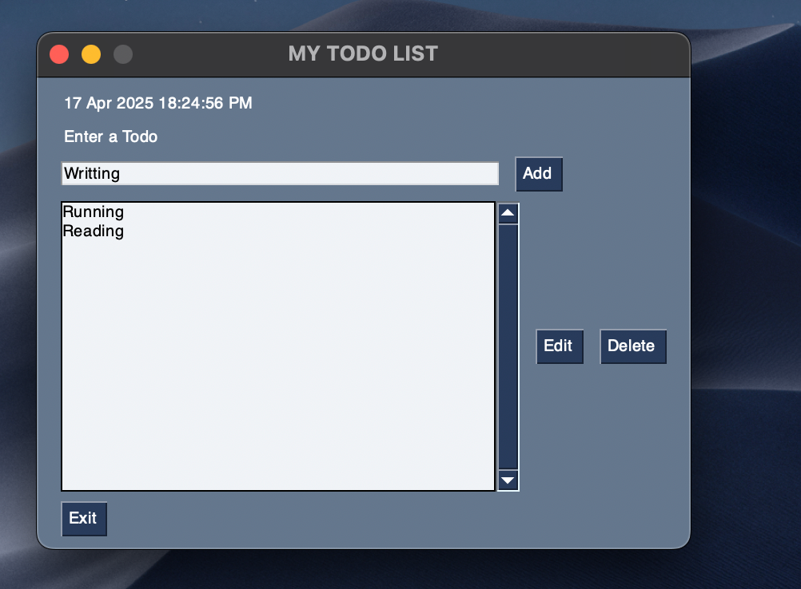

# 📝 My Todo List (Python GUI App)

A simple and lightweight To-Do List application built with FreeSimpleGUI in Python. This desktop app allows users to manage their tasks with features like adding, editing, and deleting todos—backed by a plain text file for data storage.

## Deployment

To deploy this project run

1. **Clone or download the repo.**

2. **Install dependencies.** 
- pip install FreeSimpleGUI

3. **Run the app**

*for Windows:*
- python todo_gui.py

*for MacOs:*
- python3 todo_gui.py

## Features

- ✅ Add new tasks

- ✏️ Edit existing tasks

- ❌ Delete selected tasks

- ⏰ Real-time clock display

- 💾 Data persistence using a todo.txt file

- 🪄 Clean and simple GUI

## Tech Stack

**Python** 

**FreeSimpleGUI** for building the GUI

## Screenshots

## Author

- [@rijulmaitra](https://github.com/rijulmaitra)

